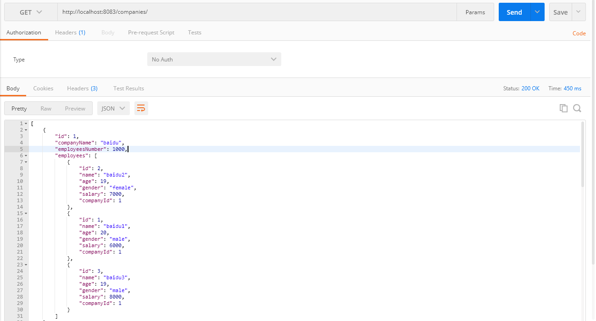
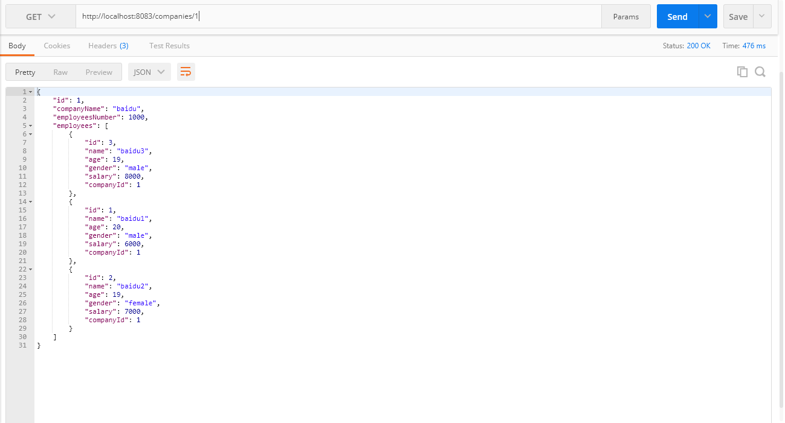
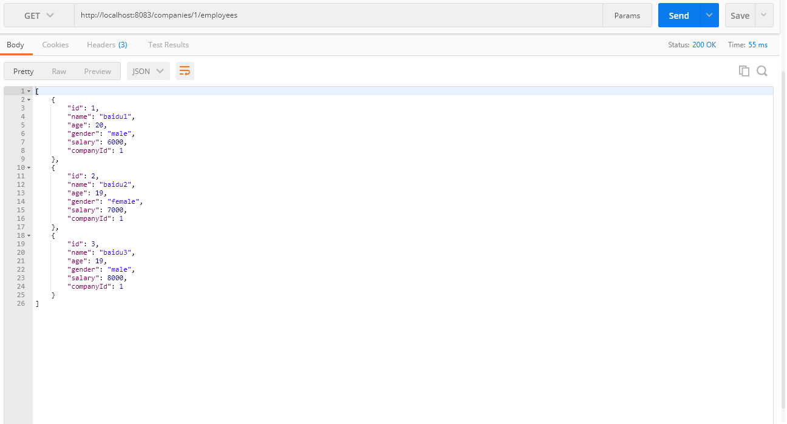
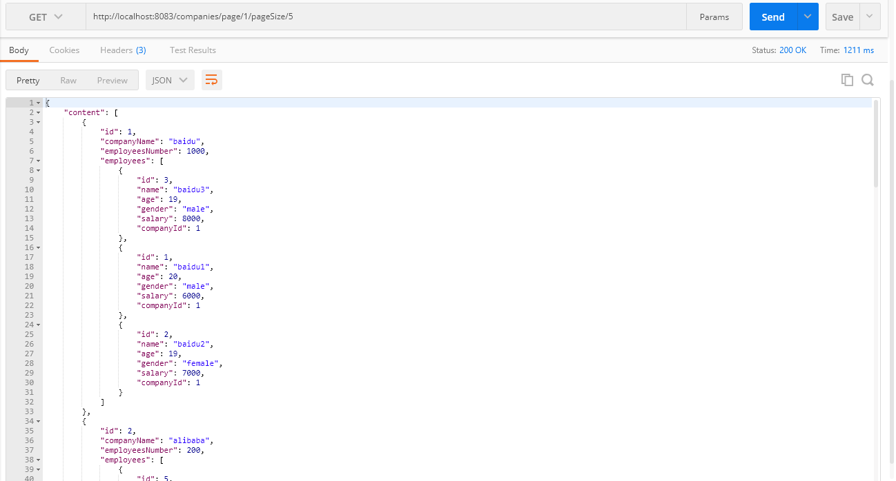
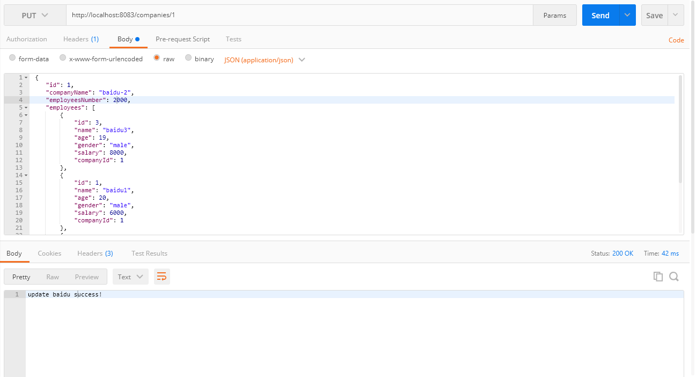
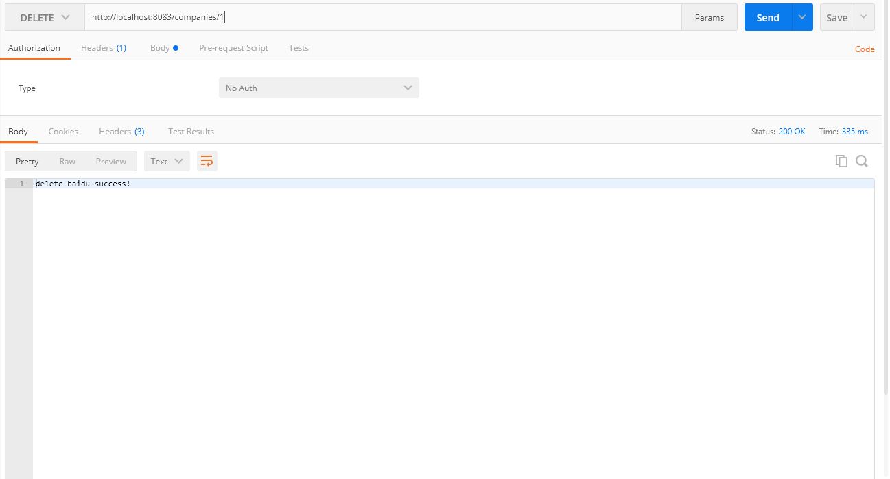
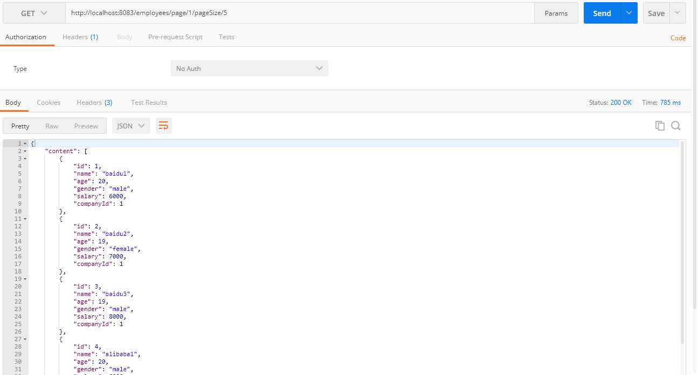
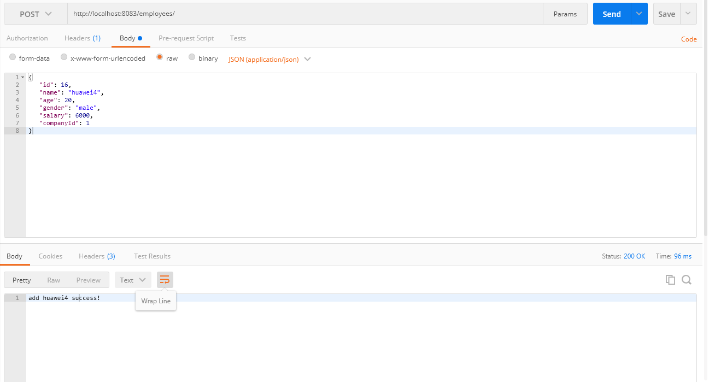
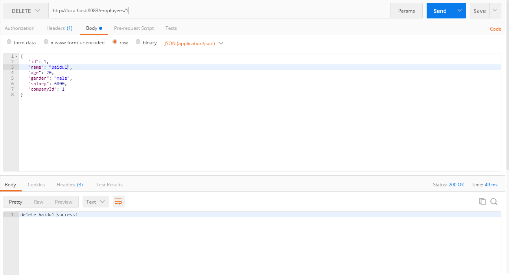

# Company API
## GET /companies

## GET /companies/1

## GET /companies/1/employees

## GET /companies/page/1/pageSize/5

## POST /companies

## PUT /companies/1

## DELETE /companies/1

# employees API
## GET /employees

## GET /employees/1

## GET /employees/page/1/pageSize/5
 

## GET /employees/male

## POST /employees

## PUT /employees/1

## DELETE /employees/1

